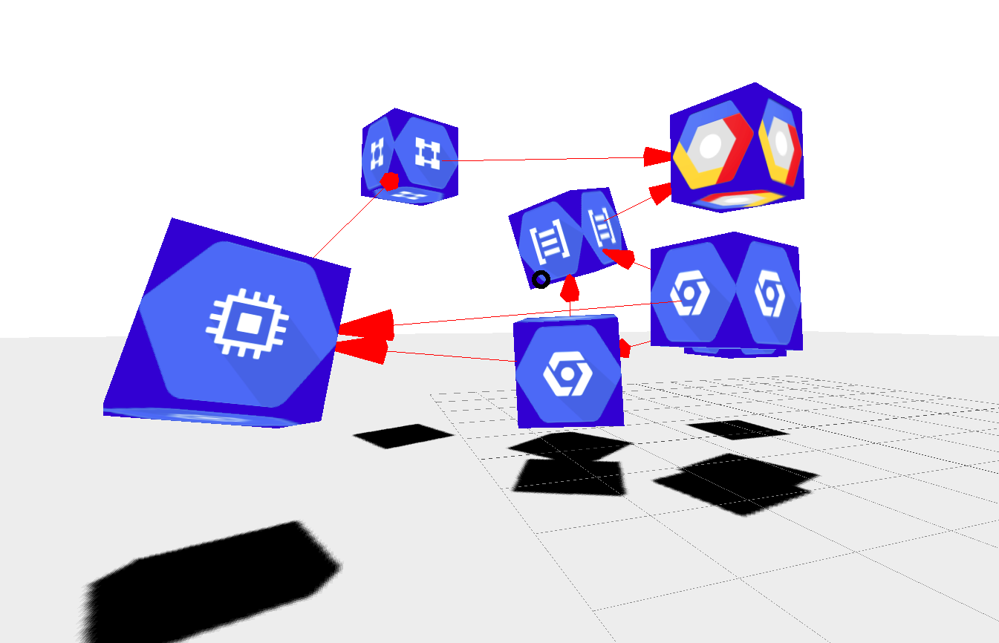

# stacksonstacks

Modular visualizations of directed graphs - specifically, terraform resources



### Set up the example
Cd to the example directory, run `./start.sh` and navigate
to http://localhost:8000.

There is no need to build if you just want to check this out, because a 
"stable" bundle file is included in the repo.

### Development install
You must run build if you want to make changes. Cd to the example directory.
You'll need to [install node.js.](https://docs.npmjs.com/downloading-and-installing-node-js-and-npm)

```sh
npm install
npm run build
```
Then, since the image files need to be served, 
run
```sh
python -m http.server
```
and navigate to http://localhost:8000

### The modules
cd to the directory. Right now there are 3:
 - threeml: sole purpose is to create textured cubes, but oh my is it good at that.
 Also specifies the NodeCube class, which is used by the scenemanager to wrangle the graph.
 - scenemanager: takes in a terraform_json and calls threeml to add cubes to the scene.
 - controlsmanager: this module hides the disgusting keystroke boilerplate to get browser movements to work

### Developing the modules
We _only_ write typescript, otherwise the world collapses. So the build process is a bit involved.
 - Before all, run `npm install` in the module directory.
 This is critical because typescript is a "devDependency",
 a dependency which doesn't ship in the package but which you'll need to recompile.
 - Make changes to `index.ts` in module directory you want to edit. 
 - Run `npm run build` to invoke the typescript compile

### Developing the example
The example is slightly different. As usual, run `npm install` before doing anything.
- Only make changes to `example/src/index.ts`. This is the "main" file.
- To build, run `npm run build`.
`npm run build` invokes webpack, which looks at the webpack config
and sees that we specify typescript, and then invokes the typescript compiler on the src file,
and bundles it into `dist/`. The `dist/bundle.js` file is the only thing included in `example/index.html`.
Webpack does all the work
- Note that dependencies are currently all local.